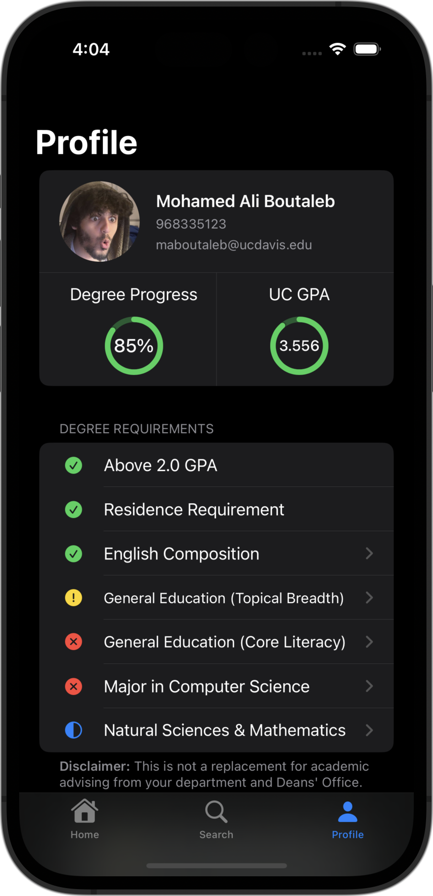
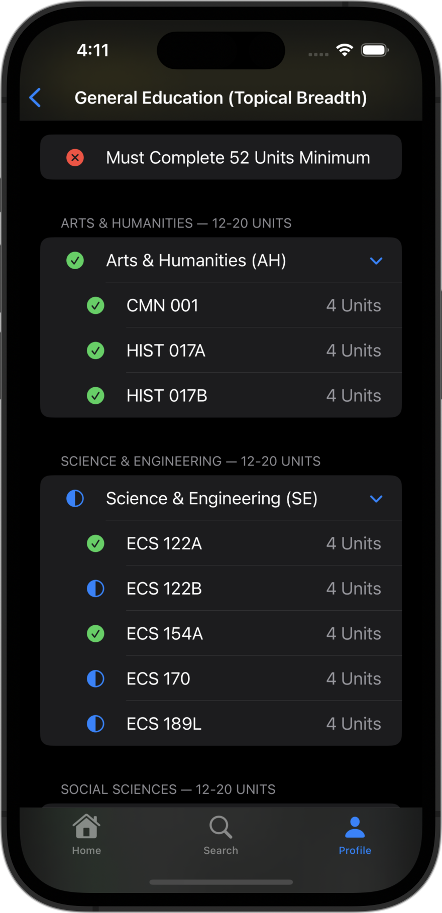
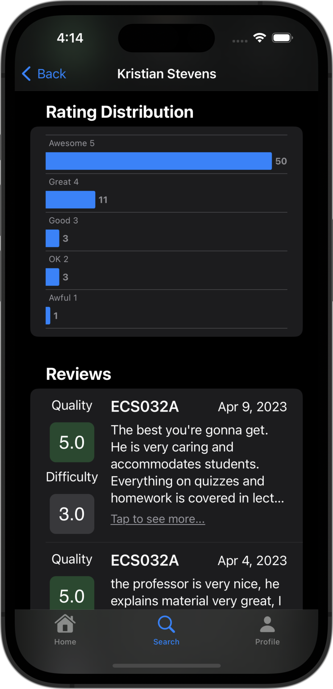
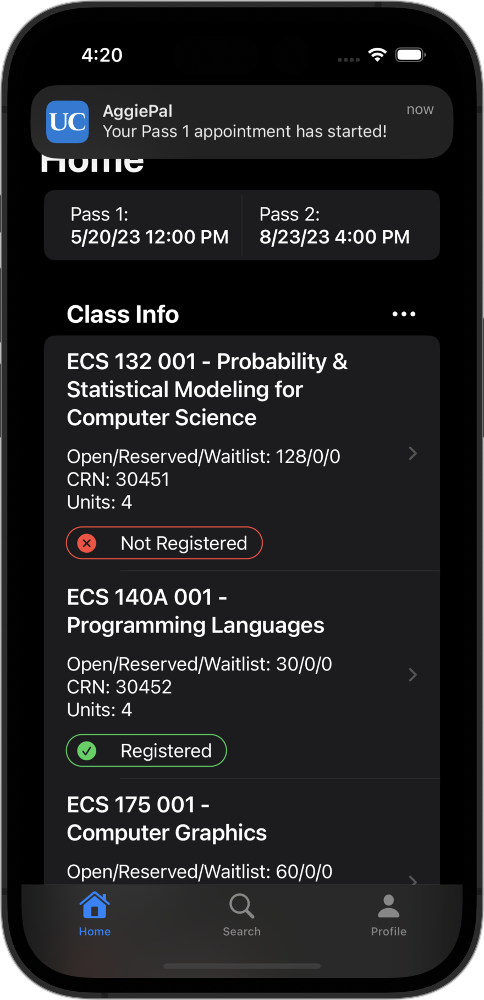
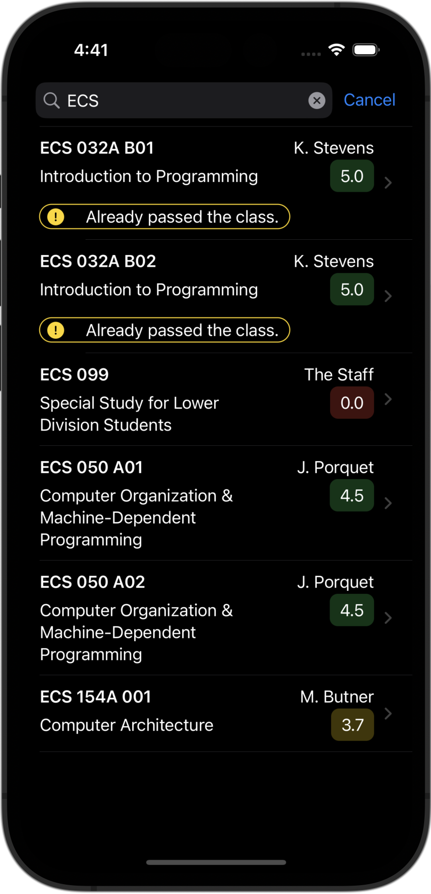

# AggiePal

A unified platform designed for UC Davis students to manage their academic lives seamlessly. (Demo purposes only, still very much incomplete.)

### Frameworks:
- SwiftUI

### Features:
- Easily plan, manage, and visualize class schedules.
- Access essential academic information like graduation requirements and academic history.
- Receive notifications for pass times.
- Navigate seamlessly through a simplified, intuitive design.
- Manage your academic responsibilities anytime, anywhere, right from your smartphone.

### Images:

  
  
  
  
  

